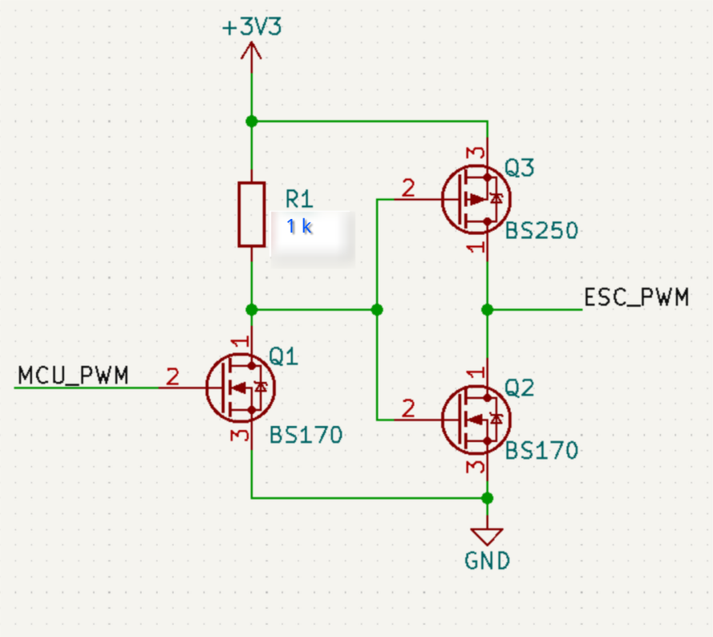

# ESC Library Demo - eurus-project

This is the example application demonstrating usage of the Eurus Flight Controller (EFC) ESC (Electronic Speed Controller) library within the Zephyr framework.

## Features & Demo configuration

The library supports multiple ESC protocols, including:
- Classic PWM
- Oneshot 125
- Oneshot 42
- Multishot

Default ESC protocol in this sample is PWM, but it can be reconfigured using menuconfig. To start menuconfig, run this command: 

`west build -t menuconfig -b <board_name> <path_to_demo>`

Next, by choosing **ESC Protocol Selection** field, the ESC protocol can be reconfigured.  

When that configuration has been set, ESC library must be set and configured. It can be done by choosing **Electronics Speed Controller (ESC) library** field. 

All analog ESC protocols have a standard minimal and maximal pulse durations:
- PWM        -> 1000-2000 us
- Oneshot125 -> 125-250 us
- Oneshot42  -> 42-84 us
- Multishot  -> 5-25 us

But in reality, this values can vary from vendor to vendor. In this demo, ESC that has been used is the one from Holybro X500 V2 ARF kit [Holybro X500 V2 ARF](https://holybro.com/products/x500-v2-kits?_pos=1&_sid=78b913d9a&_ss=r&variant=42541212008637), ESC that is based on BLHeliS firmware [BLHeliS firmware](https://bluerobotics.com/wp-content/uploads/2018/10/BLHeli_S-manual-SiLabs-Rev16.x.pdf), and it has a dead zone of 30 % starting from a minimal pulse duration. (Motor starts spining only when 30 percent of speed has been reached.) By using **Enable manual minimum thrust offset for ESC** option, this offset value can be configured.

**Enable manual maximum thrust offset for ESC** can be used to set offset of maximum pulse duration, but in this demo it wasn't necessary.

When menuconfig configuration has been completed, the demo must be built with this command: `west build -b <board_name> <path_to_demo>`

## Demo

## Requirements

### Hardware
On the hardware side, the following items are needed:
- BLDC motor
- ESC compatible with used BLDC
- Battery compatible with above (or some another power supply)
- Microcontroller that has PWM supported by Zephyr
- Additional power circuit that will provide enough current for ESC signal from a microcontroller GPIO pin (This is not needed if your ESC signal doesn't require more current that microcontroller pin can deliver!)

### Software
**Eurus Flight Controller - efc** project needs to be setup correctly. [Eurus Flight Controller](https://github.com/eurus-project/efc)

### ESC Demo Overview
#### PWM Initialization
Firstly, the demo will check if corresponding PWM pin has been setup correctly in devicetree overlay. 
#### ESC Initialization
Next step is ESC initialization, demo checks what protocol has been setup in menuconfig and initializes ESC library according to the chosen ESC protocol. 
#### ESC Arming Procedure
Arming procedure lasts for couple of seconds, and if everything has been done correctly, LED used as a indicator is going to blink 10 times on 100 ms. 
#### ESC Working Demonstration
The demonstration of BLDC motor control has been implemented as **ramp up** - **ramp down**, the speed of BLDC motors increases by 10 percent on every 1000 ms and when 100 % is reached, the speed has been decreased by 10 % on every 1000 ms.
This has been executed in a never ending loop. On every speed change, the LED will toggle.

